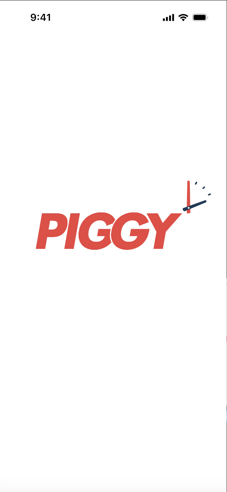

# PIGGY 기획서

### **🐽 PIGGY 서비스 소개**
PIGGY는 사용자가 다른 사용자와 약속을 생성하고 해당 약속의 정보를 함께 관리할 수 있는 커뮤니티 앱입니다.  
친구들과 함께 약속을 세우고, 그 약속을 잊지 않고 성실히 이행할 수 있도록 **동기부여**와 **보상**을 결합한 시스템을 제공하고 있습니다.  
PIGGY는 시간 관리와 약속의 중요성을 강조하면서도, 이를 게임화하여 재미있고 유익한 방식으로 제공합니다.
 

### **주요 기능**
1. **약속 생성 및 관리**:  
  사용자는 PIGGY 앱에서 간편하게 약속을 생성할 수 있습니다.  
  약속 장소를 지도에서 선택하고, 날짜와 시간을 설정한 후 친구들을 초대할 수 있습니다.  
  약속은 단순한 모임뿐만 아니라 다양한 활동에 활용될 수 있습니다.  
   
2. **PIGGY 포인트 시스템**:
  약속을 만들 때, 사용자는 "PIGGY 포인트"를 보증금으로 설정할 수 있습니다.  
  모든 참여자는 이 포인트를 걸어두어야 하며, 약속을 성실하게 지키는 것을 독려합니다. 
   
3. **보증금 제도**:
  약속을 지키지 않는 경우, 해당 사용자가 걸어둔 PIGGY 포인트는 약속을 지킨 친구들에게 자동으로 분배됩니다.  
  이 시스템은 사용자가 약속을 지키도록 동기부여하며, 약속을 지킨 사람들에게는 추가적인 보상을 제공합니다. 
   
4. **PIGGY 포인트 사용**:
  사용자가 모은 PIGGY 포인트는 앱 내 상점에서 물건을 구매하는 데 사용할 수 있습니다.  
  이로 인해 PIGGY 포인트는 실제 가치를 가지게 되며, 사용자는 약속을 지킴으로써 실질적인 혜택을 얻게 됩니다. 
   
5. **커뮤니티와 상호작용**:
  PIGGY는 단순한 약속 관리 앱을 넘어 친구들과의 상호작용을 촉진합니다.  
  약속 내역을 공유하고, 친구들과의 성과를 기록하며, 더 나아가 공동의 목표를 설정하여 협력할 수 있습니다.
   

## Prototype✨

스플래쉬 화면

홈화면

로그인 화면

약속 상세 화면

초기 사용자 정보 입력 화면

약속 잡기 스텝폼(1) - 제목, 참석자

약속 잡기 스텝폼(2) - 장소

약속 잡기 스텝폼(3) - 날짜

약속 잡기 스텝폼(4) - 시간

약속 잡기 스텝폼(4) - 벌금

약속 확인

친구 리스트 화면

사용자 검색

친구 상세 정보

상점

상품 정보

보관함

보관함 쿠폰 확인

피기 충전 화면

피기 사용 내역 확인 화면

설정 화면

프로필 수정 화면

문의하기 화면

FAQ 화면

공지 화면

공지 상세 화면

## 기능 정의 명세서✨

[기능정의명세서](../assets/project_proposal/%E1%84%80%E1%85%B5%E1%84%82%E1%85%B3%E1%86%BC%E1%84%8C%E1%85%A5%E1%86%BC%E1%84%8B%E1%85%B4%E1%84%86%E1%85%A7%E1%86%BC%E1%84%89%E1%85%A6%E1%84%89%E1%85%A5%202bbe933c28694fbb8c65112615617ec0.csv)
